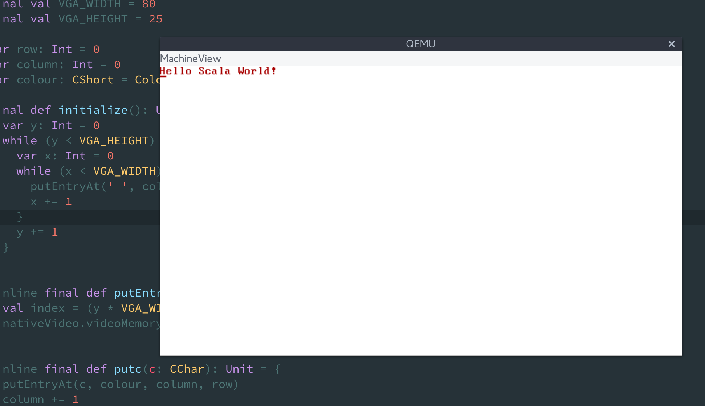

Hacking around with scala-native to run on baremetal. 

`osbuildplugin` contains the SBT plugin that calls on scala-native's compiler API to compile to IR
it also compiles accompanying C and assembly sources, links everything via a supplied linker script, strips
the output object, creates a bootable iso based on grub and launches qemu.  

`supportnative` contains the C/Assembly/Linker scripts/Grub config

`oslib` a library with methods to deal with low level things, at the moment just spitting crap out to 
video memory. 

`kernel` the actual kernel!

